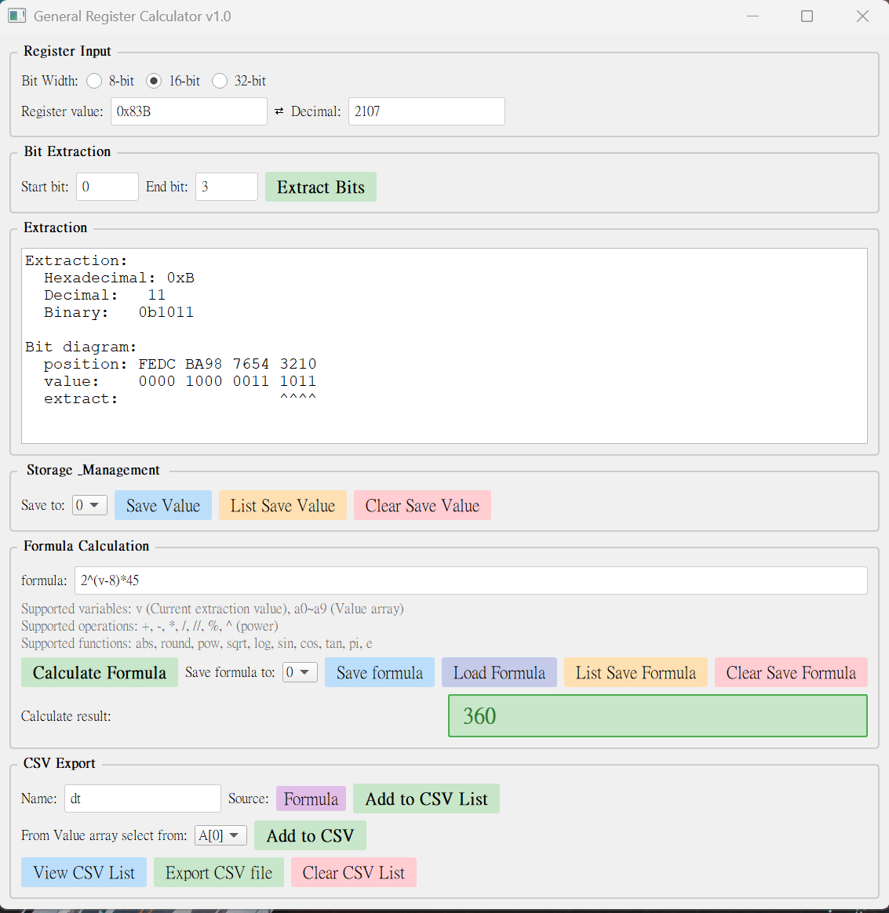

# Register Calculator

[](https://www.python.org/)
[](https://pypi.org/project/PyQt5/)
[](LICENSE)

A PyQt5-based GUI application for register bit extraction and calculation, supporting 8/16/32-bit registers.

---

## Features

- 🔧 **Bit Extraction**: Extract specific bit ranges from 8/16/32-bit registers
- 🧮 **Formula Calculation**: Evaluate formulas with variables and math functions
- 📊 **Array Storage**: Manage values in Extract , Formula Calculate arrays
- 📁 **CSV Export**: Can add description Export calculation results to CSV files
- 🎨 **Visual UI**: Clean pastel color scheme with functional organization

---

## Quick Start

```bash
# Install dependencies
pip install PyQt5

# Run application
python main.py
```

---

## Usage

### HEX <-> DEC
1. directly typ the value HEX or DEC than will change to other side

### Extract Bits
1. Select bit width (8/16/32-bit)
2. Enter register value (e.g., `0xABCD`)
3. Enter start and end bit
4. Click "Extract Bits" or "Save Value" to save

### Calculate Formula
1. Extract bits to get value `v` or use store before Extract value `a0~a9`
2. Enter formula (e.g., `2v^*a0 - 148`) or Click "Load Formula" to load saved formula
3. Click "Calculate Formula"
4. Click "Save Formula" to save

### Export CSV
1. Add values with names
2. Choose the CSV value source from extraction or formula
3. Click "Add to CSV List" to temp storage
4. Or you can save value from extract value array `a0~a9`
5. Click "Add to CSV" to temp storage
6. Click "view CSV List" to check storage value, if is not you want can click than delete
7. After you comfirm the CSV value, click "Export CSV file" to export the file

---

## Examples

**Extract bit[11:4] from 0xABCD:**
```
Result: 0xBC (188)
Bit diagram shows extraction range visually
```

**Calculate formula:**
```
because the extract result is 188
v = 188
a0 = 25 (the value before you store)
Formula: v*a0 - 148
Result: 4552
```

---

## Project Structure

```
register-calculator/
├── main.py              # Entry point
├── RegisterCalculator.py     # Core logic
├── RegisterCalcGUI.py      # GUI interface
└── README.md            # This file
```

---

## Screenshots



---

## Author

**Your Name**
- GitHub: [@codebra721](https://github.com/codebra721)
- Email: daniel852109@gmail.com

---

## License

MIT License - see [LICENSE](LICENSE) file for details.

---

**Made for developers who tired of calculating register bits with Microsoft Calculator**
